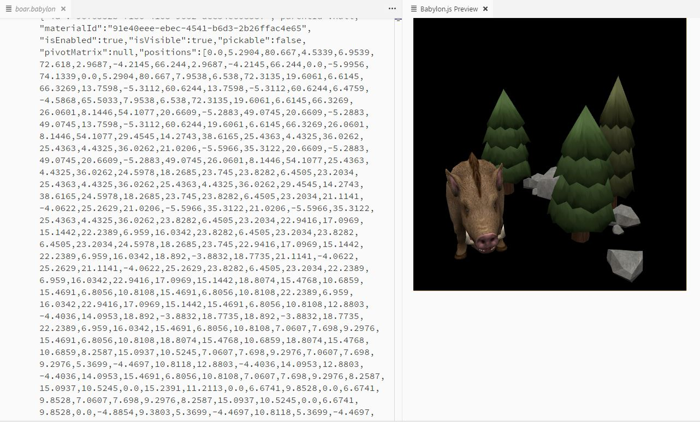

# Babylon.js file viewer

This extension adds a preview panel on .babylon file, displaying the file content.

## Screenshots

## How to use it
Use `1` or `2` below:
1. Open a Babylon.js asset file (ends with `.babylon`). Press <kbd>CTRL+ALT+O</kbd> to open the preview panel.
2. Open a Babylon.js asset file (ends with `.babylon`). Press <kbd>CTRL+SHIFT+P</kbd>, and type `Babylon`. Press <kbd>Enter</kbd>.

## Known Issues

File larger than 5MB cannot be seen by extension, and thus will not be displayed.

## Release Notes

### 1.1.0
Meshes list added. Replaced black clear color with transparent color.

### 1.0.1
Icon and readme updated.

### 1.0.0
Initial release of this extension.
